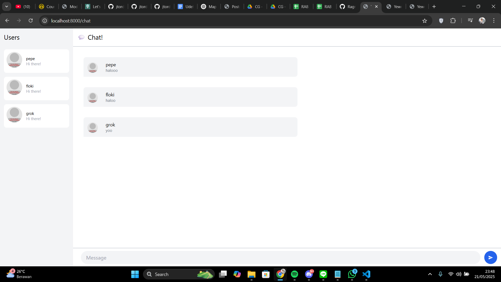
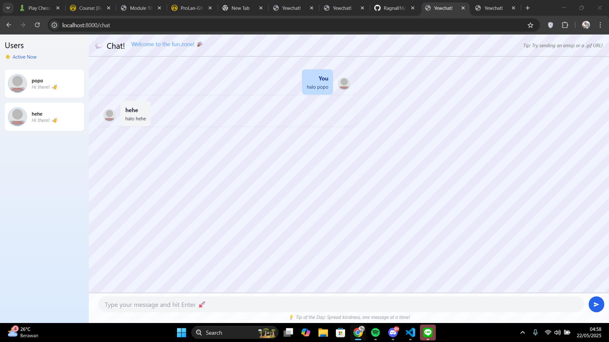

# Original Code

# Be Creative

I add some modification for the chat UI such as creative welcome banner with emoji, fun "Tip of the Day" below the chat input, User avatars in the message list fallback to a default if not found, Colorful message bubbles: messages from the current user are styled differently, Add a subtle background pattern for the chat area.